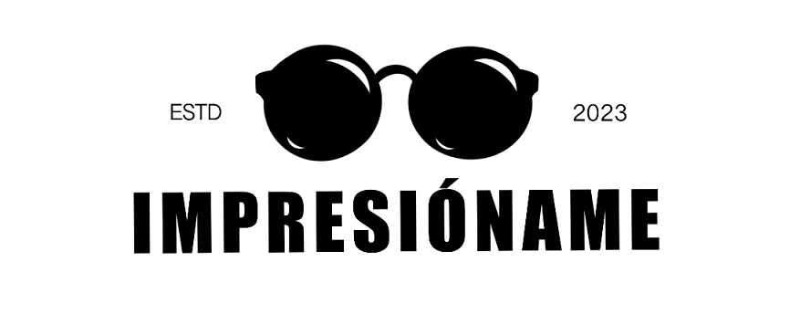

# IMPRESIÓNAME 👓

    

First version of an online glasses store, where you can see different catalogs depending on the categories, and allows the user to make purchases using a cart.

For the following versions I want to add an option so that the user can view the glasses model using augmented reality technology, we also want to implement the ability to customize a glasses model.

  

## MORE ABOUT   📃
The IMPRESIÓNAME Project is an initiative of the Esteve Terradas e Illa Institute of Barcelona.
Participating in this project:
+ Esteve Terradas i Illa Institute (Barcelona).
+ CIPFP MISLATA (Valencia)
+ Technological Institute of the Canary Islands (ITC).
+ IES El Rincón.
+ LASERCAN (Valencia)

The objective of the project is to create an App that allows customers to create their own glasses at from different 3D models using augmented reality so that the user can go seeing how it looks. Once you are satisfied with the design you can purchase said design at the
web and finally it will arrive printed at your home.

  

## INDEX 📃
- [MODEL AND DIAGRAMS INFO](#idModels)
- [USER REQUIREMENTS](#idRequirements)
- [USER REQUIREMENTS](#idRequirements)
- [USER MANUAL](#idUsermanual)
- [INSTALLATION MANUAL](#idInstallManual)
- [BUILD WITH](#idBuild)
- [PLANNING](#idPlaning)
- [MOCKUP](#idMockup)
- [POSTMAN](#idPostman)
- [AUTHOR](#idAuthor)
- [CONCLUSION](#idConclusion)

  

## MODEL AND DIAGRAMS INFO  📊

Database structure and its respective diagrams.

### ENTITIES 📝
* User: The user has an id, a username, name, last name, mail, password and role.

* Direction: It has an id, a direction, post-code, location, province.

* Purcharse: It has an id, a date, total and status.

* Article: It has an id, a name, description, price, category and stock.

### RELATIONSHIPS 🔌
* A user can have one or more direction, but one direction must be for one user.

* A user may not do a purcharse or may do many purcharses, but one purcharse must be just for one user.

* A purcharse can carry one or more articles, but one article can not belong to a purcharse or can be in many purcharses.

  

### CLASS DIAGRAM

    

### ENTITY-RELATIONSHIP DIAGRAM

    

### UML DIAGRAM

    

### RELATIONAL DIAGRAM

    

### RELATIONAL MODEL

* User (**id**, username, name, last_name, mail, password, role)

* Direction (**id**, direction, post_code, location, province, user_id*)

* Purcharse (**id**, date, total, status)

* Article (**id**, name, description, price, category, stock)

* Carry (**id_purcharse***, **id_article***)

  

## USER REQUIRMENT  👤
Web Aplication

If you are a guest, you will see the home, all the shops pages, and you can log-in and register also.

If you are a user, you will see the catalogue and you can add products and buy it, you can go to your profile and there you can view and add address, edit update(not recommended yet) and log out, you can also see all your purchases.

If you are an admin, you will see the same features like user but you can add, edit and
delete products and finally you can edit and remove the status of users purchases.

### USE CASE DRIAGRAM

    

  

## USUABILITY ✨

1. **Intuitive Design:**
   + Ensure that the navigation and overall site design are intuitive, allowing users to easily find what they are looking for. Guest options should be accessible to everyone, and user options are available from the same page.

2. **Design Consistency:**
   + Maintain consistency in the design across all pages to make users feel comfortable and avoid confusion when transitioning from one section to another.

3. **Color Contrast:**
   + Maintain good contrast between text and background to facilitate readability.

4. **Responsives:**
   + The application is fully responsive between mobile devices, tablets and PC.

5. **Forms:**
   + Simplify forms as much as possible by removing unnecessary fields and organizing them into clear sections.

6. **Clear Error Messages:**
   + If a user makes an error while completing a form, provide clear error messages and suggested solutions to address the issue.

7. **Language Simplification:**
    + Use clear and simple language throughout the content to make it understandable to the all the  possible audience.

8. **Meaningful Icons:**
    + Use icons with clear and universal meanings. Provide labels or tooltips for users who may have difficulty interpreting icons.

9. **Fast Loading:**
   + Web with fast loading times, contributing to a more enjoyable user experience.

  

## USER MANUAL  🙇

__[If you want to see more details and an actual manual click here.](/USER-MANUAL/IMPRESIONAME-USER-MANUAL.pdf)__

 

### 1. First of all, the user will see the Home page.

### 2. Inside the Home you will see "Newest" which is an automatic slider, where you can click on a glass to take you to your own page.

### 3. Below we will have the categories, which are divided into three, [Men, Women and Kids], you can click on each category and it will take you to its respective store page.

### 4. In the Header we will see three horizontal stripes, if we press it it will take us to the web menu.

### 5. This would be the menu, which will take us to the pages of [ Home, Men, Women, Kids, Sing-in and Sing-up ], to close the menu we can press the x at the top right.

### 6. In the Header we will also see a user icon, which will take us to the user's profile page if they have logged in or created an account, and if not, to create an account or log in.

### 7. We will see two sections, one to create an account and another for log-in.

### 8. If we have an account we can sing-in in this form.

### 9. If you do not have an account you must create one by clicking the "Create Account" button.

### 10. Once you have logged in or created an account, by clicking on the user icon we will see our information, in turn three buttons, one to see our shipping addresses, another to see our purchases and the last to log-out.

### 11. If we click on the "View Addresses" button it will take us to the user's address page.

### 12. We will see that it is divided into two sections, Directions Info and Add New Address.

### 13. To create an address we will use the form on the right.

### 14. And we will see the address created in Directions Info.

### 15. Before seeing the purchases we should see how the basket and the stores work.
To do this we will click on the cart icon in the Header.

### 16. In the basket, we will see on the left the glasses that we have added, and on the right the total of the basket and a button to make the purchase.

### 17. To delete an article we will click on the delete button.

### 18. Once deleted we will see the basketball.

### 19. Using the menu described above we will see how to buy items, for example we will go to the Menu page.

### 20. For example, we will click on Glasses 6.

### 21. It will take us to the page of that glasses, where we can add it to the basket.
If we click the Add to Basket button it will be added to our basket.

### 22. If we return to the cart we will see the added glasses.

### 23. If we click on the Do Purchase button, the purchase will be made and it will take us to our purchases page.

### 24. This is our purchases page where we can check the status of our purchases.

### 25. To finish with the users, the View Purchases button will take us to the previous page, and we will have the Log-Out button.

### 26. To log-out we will press the Log-Out button and it will take us to the page to start sing-in.

### 27. We will return to the page to create the log-in.
If without having an account we try to go to the basketball page or the user page, it will take us to the create or log-in home page.

 

***
To see the manual with more info click [HERE](/USER-MANUAL/IMPRESIONAME-USER-MANUAL.pdf)

  

## INSTALLATION MANUAL  🔧

    To start using the app, we will need ReactJS, NodeJS and MySQL as Data Base.

 

### INSTALL NODEJS
    
_*You need to download and install [NodeJS](https://nodejs.org/en/download/current)*._

You can check your version with:  

    npm -v

_*Recommended to have version: 9.6.7 or higher*._

 

### INSTALL THE PROJECT AND THE DEPENDENCIES 💾

*Then, you need to git clone the repository:*.

    git clone https://github.com/adanelrincon/Impresioname.git

 

*When we have the cloned project, we will move to the backend folder to install the dependencies this way:*.

     cd Impresioname/
     cd backend/
     npm install

 

*In another terminal we will do the same, we will go to the folder in which we have cloned the project and we will follow these commands:*.

     cd Impresioname/
     cd frontend/
     npm install

  

### INITIALIZE THE PROJECT 💻

*First, in MySQL you need to create a new Data Base*.

 

*Then, in the backend you need to create the .env with your data*.

 

 

*If you don't know how to do it, I have a .env.example which you can copy and change the name to .env, once this you would fill it in with your data:*.

 

 

DB_NAME will be the name of the DB that we created previously, and DB_PASSWORD_ will be the root user password to access the same DB.

 

*To start the backend we will follow this command being inside the /backend folder of the project:*.

     npm run dev

 

*To start the frontend we will follow this command being inside the /frontend folder of the project:*.

     npm start

  

## BUILD WITH  🛠️

MySQL:

* MySQL is a relational database management system based on SQL. It's widely used for storing and managing structured data. In the context of your project, MySQL will act as the database to store application data.
 

Express:

* Express is a web application framework for NodeJS. In your application, Express will be used as the server-side framework to handle HTTP requests, define routes, and manage server logic.
 

NodeJS:
* NodeJS is a JavaScript runtime environment on the server side. In this project, NodeJS will be used to run the application server. Its single-threaded, event-driven nature makes it ideal for scalable and high-performance web applications.
 

Sequelize:

* Sequelize is an Object-Relational Mapping (ORM) for NodeJS. It simplifies interaction with relational databases, such as MySQL, through JavaScript. Sequelize streamlines database queries and provides an object-based data model instead of direct SQL queries.
 

ReactJS:

* ReactJS is a JavaScript library for building interactive user interfaces. In the context of your project, ReactJS will be used on the client side to build the user interface. You can create reusable components and efficiently manage the application state.

  

## TECHNOLOGIES COMPARATION

### MY TYPE OF APP

In my case I have a web application, since currently it only works in web browsers.
These applications stand out for their universal accessibility, eliminating the need for installation and allowing centralized maintenance. They are cross-platform, scalable and flexible, making it easy to adapt to various devices and changing requirements. Additionally, they offer convenient access from anywhere, promote real-time interactivity, and are search engine friendly.

 

### MySQL:
**Advantages:**
+ **Native Apps:** Excellent choice for native applications where complex data manipulation and high performance are crucial.
+ **Hybrid Apps:** Can be used, but performance might be influenced by the hybrid environment.
+ **Web Apps:** Widely used in web applications to store and manage structured data.

**Disadvantages:**
- **Hybrid Apps:** Performance may be affected in hybrid environments.

**Alternatives:**
- PostgreSQL vs MySQL: Both are powerful relational databases, but PostgreSQL is known for its extensibility and support for advanced data types.
- MongoDB vs MySQL: MongoDB is a NoSQL database, suitable for handling unstructured data and providing high scalability.

### Express:

**Advantages:**
+ **Native Apps:** Suitable for native applications requiring a robust and fast server to handle HTTP requests.
+ **Hybrid Apps:** Can be used for server logic, but performance may be impacted in hybrid environments.
+ **Web Apps:** Primarily used as a web application framework to define routes and manage server logic in web applications.

**Disadvantages:**
- **Hybrid Apps:** Performance may be affected in hybrid environments.

**Alternatives:**
- Koa vs Express: Koa is a more lightweight alternative to Express, focusing on modularity and simplicity.
- Django vs Express: Django is a high-level Python web framework known for its simplicity and rapid development.

### NodeJS:

**Advantages:**
+ **Native Apps:** Ideal for native applications due to its efficiency in handling multiple simultaneous connections and events.
+ **Hybrid Apps:** Can be used, but certain performance aspects may be affected compared to native usage.
+ **Web Apps:** Widely used on the server side to build efficient and scalable web applications.

**Disadvantages:**
- **Hybrid Apps:** Some performance aspects may be affected compared to native usage.

**Alternatives:**
- Django (Python) vs NodeJS: Django provides a robust framework for building web applications in Python.
- Ruby on Rails vs NodeJS: Ruby on Rails is a web application framework in Ruby, known for its convention over configuration.

### Sequelize:

**Advantages:**
+ **Native Apps:** Beneficial in native applications for simplifying interactions with the database through object-relational mapping.
+ **Hybrid Apps:** Can be used, but some advanced features may not be fully compatible in hybrid environments.
+ **Web Apps:** Useful for simplifying database queries in web applications and providing an object-based data model.

**Disadvantages:**
- **Hybrid Apps:** Some advanced features may not be fully compatible in hybrid environments.

**Alternatives:**
- TypeORM vs Sequelize: TypeORM is an alternative ORM for TypeScript and JavaScript with a focus on flexibility.
- Hibernate (Java) vs Sequelize: Hibernate is a widely used ORM solution for Java applications.

### ReactJS:

**Advantages:**
+ **Native Apps:** Commonly used in native applications to build interactive and scalable user interfaces.
+ **Hybrid Apps:** Can be used in hybrid apps, especially with frameworks like React Native, offering a more native-like user experience compared to traditional hybrid web apps.
+ **Web Apps:** Essential for building interactive and responsive user interfaces on the client side for web applications.

**Disadvantages:**
- **Hybrid Apps:** There may be certain limitations compared to native development.

**Alternatives:**
- Vue.js vs ReactJS: Vue.js is a progressive JavaScript framework for building user interfaces with a simpler learning curve.
- Angular vs ReactJS: Angular is a comprehensive front-end framework, offering a full solution for building web applications.

  

## PLANNING 📅  

+ [To see the planning click here](https://github.com/users/adanelrincon/projects/1)

 

## MOCKUP  👀

+ [My Figma Mockup](https://www.figma.com/file/U3BMeKt6Wr9o0ZGAILdvsP/IMPRESIONAME?type=design&node-id=0%3A1&mode=design&t=ajF3B2kh9tfLlvGk-1)

 

## POSTMAN  📑

+ If you want to see the API Backend, import into POSTMAN the file in the the folder POSTMAN.

 

## AUTHOR  👋

+ [By Adán Pérez Hernándeaz](https://github.com/adanelrincon)

 

## CONCLUSION  💬

In my conclusion, I think that I have worked a lot on the project throughout the month, I sat a lot in the Backend and that is why some functionalities are missing in the Frontend.
But I hope to be able to implement them in the second quarter along with the possibility of seeing the glasses with virtual reality technology.
Thanks to ITC for such an interesting project and with a technological stack that I really like a lot.
    
 

-----

