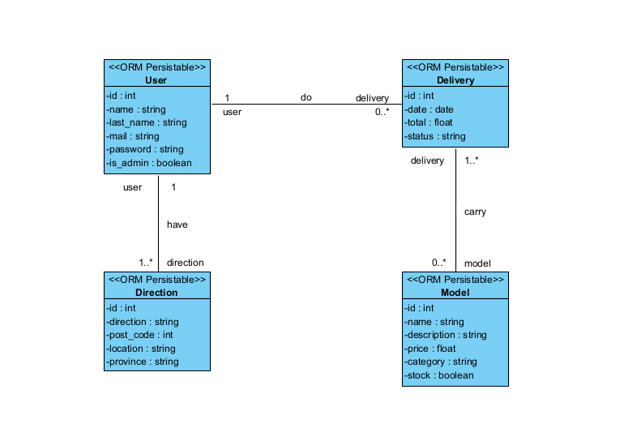
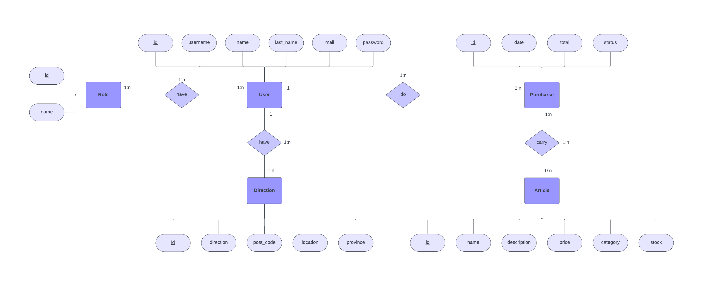
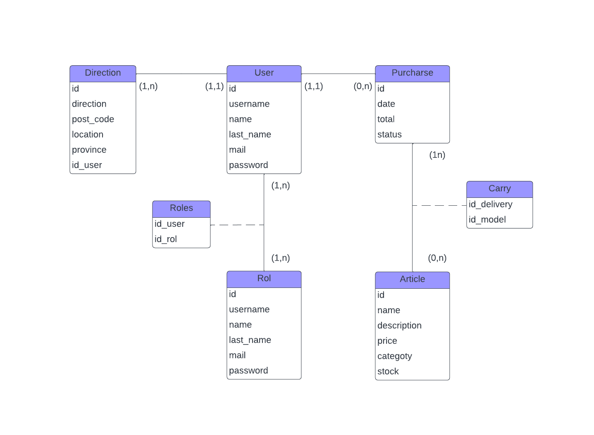
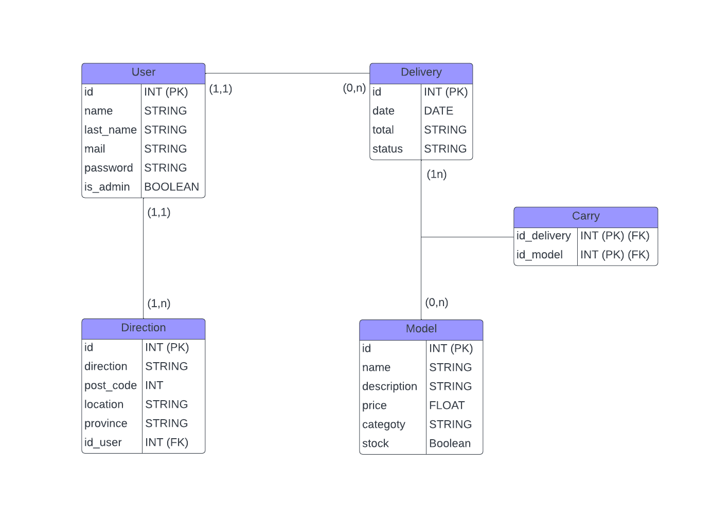
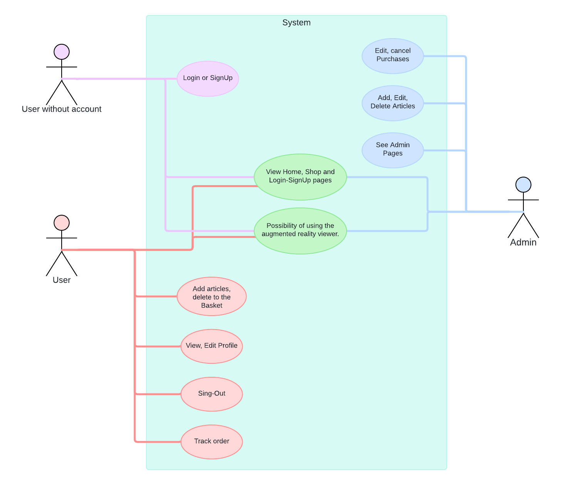

# IMPRESIÓNAME 👓

This application consists in a shop page were a user can buy and see a catalogue of glasses and in a future customize glasses by her own.

  

## MORE ABOUT   🔨 

Build in React `[JS]` , NodeJS `[Express - Sequelize]` & MysQL.

  

## MODEL AND DIAGRAMS INFO  📊

Database structure and its respective diagrams.

### ENTITIES 📝
* User: The user has an id, a username, name, last name, mail, password and role.

* Direction: It has an id, a direction, post-code, location, province.

* Purcharse: It has an id, a date, total and status.

* Article: It has an id, a name, description, price, category and stock.

### RELATIONSHIPS 🔌
* A user can have one or more direction, but one direction must be for one user.

* A user may not do a purcharse or may do many purcharses, but one purcharse must be just for one user.

* A purcharse can carry one or more articles, but one article can not belong to a purcharse or can be in many purcharses.

  

### CLASS DIAGRAM

    

### ENTITY-RELATIONSHIP DIAGRAM

    

### UML DIAGRAM

    

### RELATIONAL DIAGRAM

    

### RELATIONAL MODEL

* User (**id**, username, name, last_name, mail, password, role)

* Direction (**id**, direction, post_code, location, province, user_id*)

* Purcharse (**id**, date, total, status)

* Article (**id**, name, description, price, category, stock)

* Carry (**id_purcharse***, **id_article***)

  

## User Requirement  👤
    Web Aplication

    If you are a guest, you will see the home, all the shops pages, and you can log-in and register also.

    If you are a user, you will see the catalogue and you can add products and buy it, you can go to your profile and there you can view and add address, edit update(not recommended yet) and log out, you can also see all your purchases.

    If you are an admin, you will see the same features like user but you can add, edit and
    delete products and finally you can edit and remove the status of users purchases.

### USE CASE DRIAGRAM

    

  

-----------------------------------

## Installation Manual  🔧

    To start using the app, we will need ReactJS, NodeJS and MySQL as Data Base.

 

### Install NodeJS
    
_*You need to download and install [NodeJS](https://nodejs.org/en/download/current)*._

You can check your version with:  

    npm -v

_*Recommended to have version: 9.6.7 or higher*._

 

### Install the Project and the Dependencies 💾

*Then, you need to git clone the repository:*.

    git clone https://github.com/adanelrincon/Impresioname.git

 

*When we have the cloned project, we will move to the backend folder to install the dependencies this way:*.

     cd Impresioname/
     cd backend/
     npm install

 

*In another terminal we will do the same, we will go to the folder in which we have cloned the project and we will follow these commands:*.

     cd Impresioname/
     cd frontend/
     npm install

  

### Initialize the Project 💻

*First, in MySQL you need to create a new Data Base*.

 

*Then, in the backend you need to create the .env with your data*.

 

 

*If you don't know how to do it, I have a .env.example which you can copy and change the name to .env, once this you would fill it in with your data:*.

 

 

DB_NAME will be the name of the DB that we created previously, and DB_PASSWORD_ will be the root user password to access the same DB.

 

*To start the backend we will follow this command being inside the /backend folder of the project:*.

     npm run dev

 

*To start the frontend we will follow this command being inside the /frontend folder of the project:*.

     npm start

  

## BUILD WITH  🛠️

MySQL:

* MySQL is a relational database management system based on SQL. It's widely used for storing and managing structured data. In the context of your project, MySQL will act as the database to store application data.
 

Express:

* Express is a web application framework for NodeJS. In your application, Express will be used as the server-side framework to handle HTTP requests, define routes, and manage server logic.
 

NodeJS:
* NodeJS is a JavaScript runtime environment on the server side. In this project, NodeJS will be used to run the application server. Its single-threaded, event-driven nature makes it ideal for scalable and high-performance web applications.
 

Sequelize:

* Sequelize is an Object-Relational Mapping (ORM) for NodeJS. It simplifies interaction with relational databases, such as MySQL, through JavaScript. Sequelize streamlines database queries and provides an object-based data model instead of direct SQL queries.
 

ReactJS:

* ReactJS is a JavaScript library for building interactive user interfaces. In the context of your project, ReactJS will be used on the client side to build the user interface. You can create reusable components and efficiently manage the application state.

  

 

## PLANNING 📅  

+ [To see the planning click here](https://github.com/users/adanelrincon/projects/1)

 

## AUTHOR  👋

+ [By Adán Pérez Hernándeaz](https://github.com/adanelrincon)

 

## Conclusion  💬

    In my conclusion was a hard weeks to made this possible but I reached big goals settings by my
    self so I'm very proud of my self, this ecommerce was good to start programming a full
    stack project so I'm very happy with this project. 
---