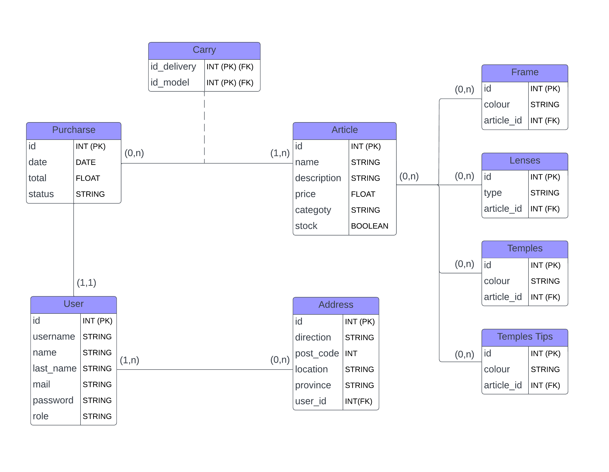

# IMPRESIÓNAME

This application consists of 

## BUILD IN

Build in React `[JS]` , NodeJS `[Express - Sequelize]` & MysQL.

  

## MODEL AND DIAGRAMS INFO

Database structure and its respective diagrams.

### Entities 
* User: The user has an id, a name, last name, mail and password.

* Direction: It has an id, a direction, post-code, location, province.

* Delivery: It has an id, a date, total and status.

* Model: It has an id, a name, description, price, category and stock.

### RELATIONSHIPS 
* A user can have one or more direction, but one direction must be for one user.

* A user may not do a delivery or may do many deliveries, but one delivery must be just for one user.

* A delivery can carry one or more models, but a model can not belong to a delivery or can be in many deliveries.

  

### USE CASE DRIAGRAM

    

### CASE DIAGRAM

    

### ENTITY-RELATIONSHIP DIAGRAM

    

### RELATIONAL DIAGRAM

    

